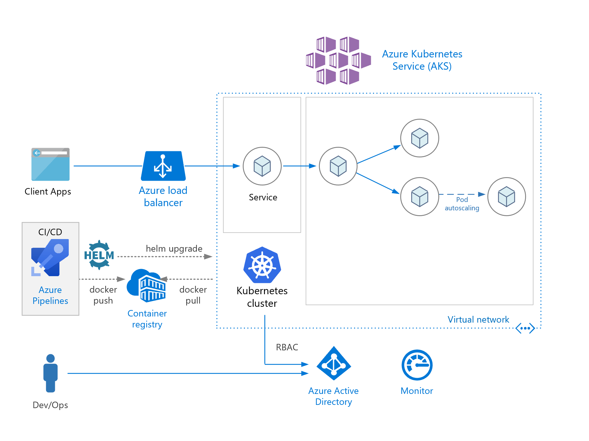

# geekready2021
## End-to-end AKS / K8S deployments

AKS allows you to quickly deploy a production ready Kubernetes cluster in Azure.
Kubernetes is a portable, extensible, open-source platform for managing containerized workloads and services.
This session will show you how to implement an end-to-end deployment in AKS / K8S following the best practices:
- Container image management
- Cluster deployment using Bicep / ARM
- K8S manifests deployment
- Azure DevOps pipelines for infra and workloads
- Auto-scaling
- Load testing

The Hello Rose World app is a simple NodeJS UI app based on Vue and ThreeJS libraries.

Demo app:

Application architecture:

